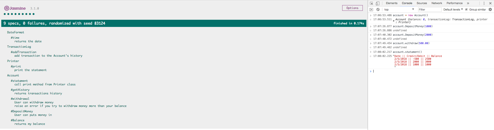
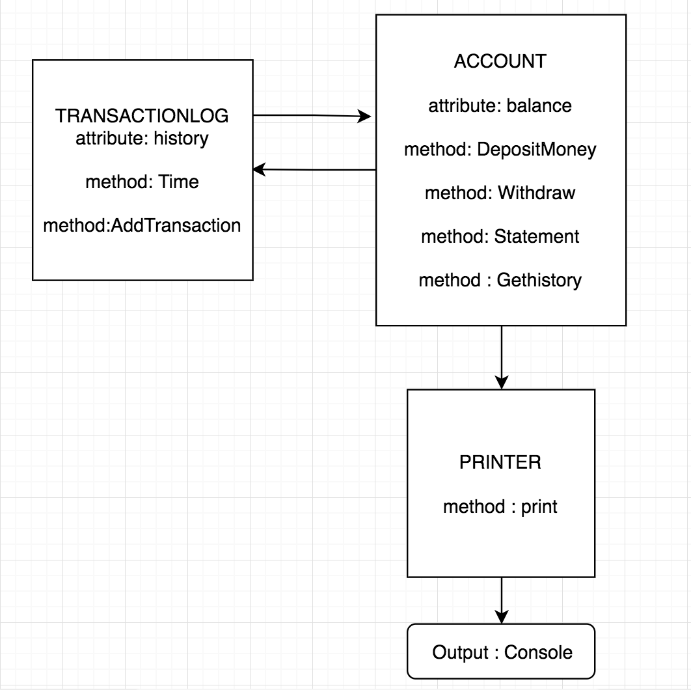

# Bank Tech-Test
 This program is going to simulate a Bank with its routine's process.

### Technologies Used
 - JavaScript
 - Jasmine


### How to run the app
```
$ git clone https://github.com/Gia1987/Bank-tech-test.git
$ cd Bank-tech-test
$ open SpecRunner.html and the console
```


### Specification
- User can makes deposit money on it.
- User can withdrawal money.
- User can see own account statement (date, amount, balance) printing.
- Data can be kept in memory (it doesn't need to be stored to a database or anything).

### Diagram Model



### Acceptance criteria
- Given a client makes a deposit of 1000 on 10-01-2012
- And a deposit of 2000 on 13-01-2012
- And a withdrawal of 500 on 14-01-2012
- When she prints her bank statement
- Then she would see

```
// My output
Date || Credit/Debit || Balance
2/5/2018 || -500 || 2500
2/5/2018 || 2000 || 3000
2/5/2018 || 1000 || 1000
```
```
// Expected output
date || credit || debit || balance
14/01/2012 || || 500.00 || 2500.00
13/01/2012 || 2000.00 || || 3000.00
10/01/2012 || 1000.00 || || 1000.00
```


### User Story
```
As Bank's customer,
So, I have a Bank Account,
I want to be able to see my balance.

As Bank's customer,
So, I can save money,
I want to be able to deposit my saving on my Account.

As Bank's customer,
So, I have access to my money,
I want to be able to withdraw at anytime.

As Bank's customer,
So, I have access to my money,
I won't withdraw much money than I have.

As Bank's customer,
So, I can track my money,
I want to be able to print my statement of Account.

As Bank's customer,
So, I can track my money,
My transactions appear with newest transaction first.

```
